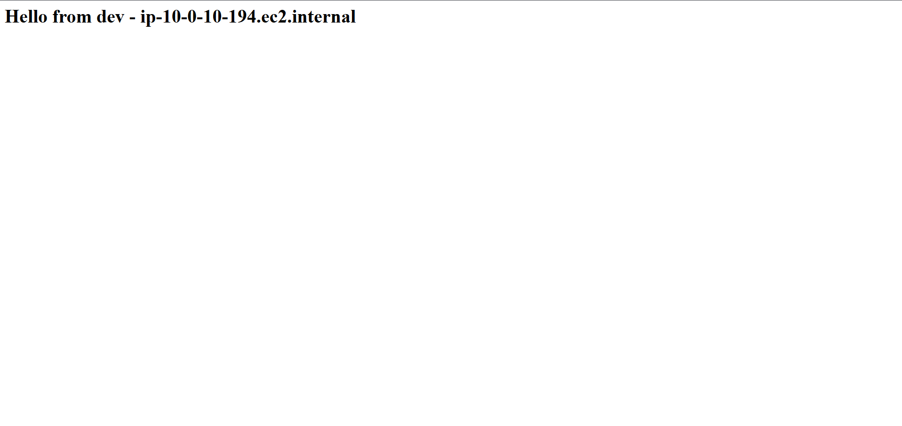
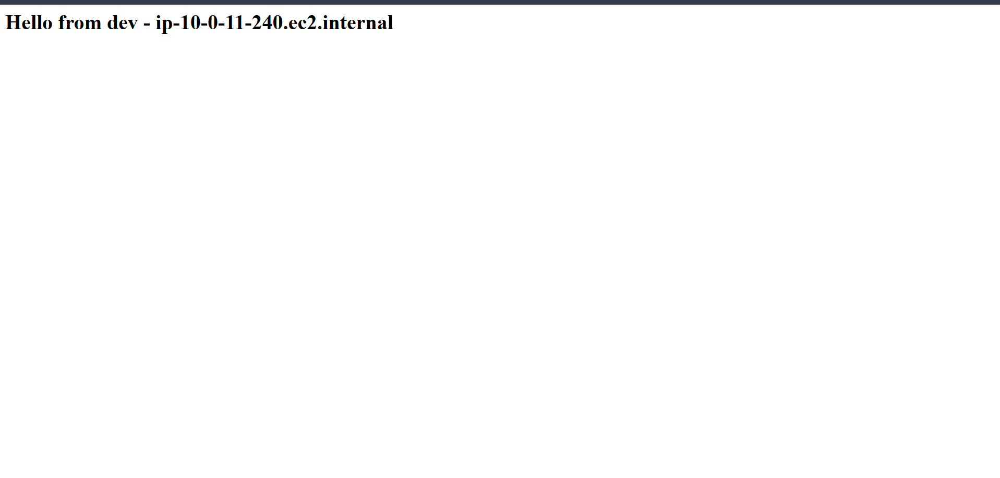
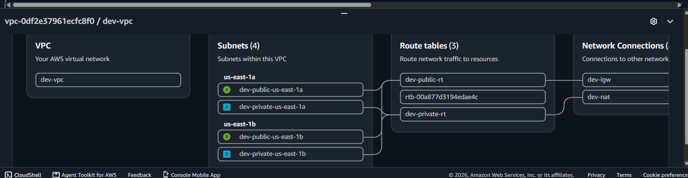
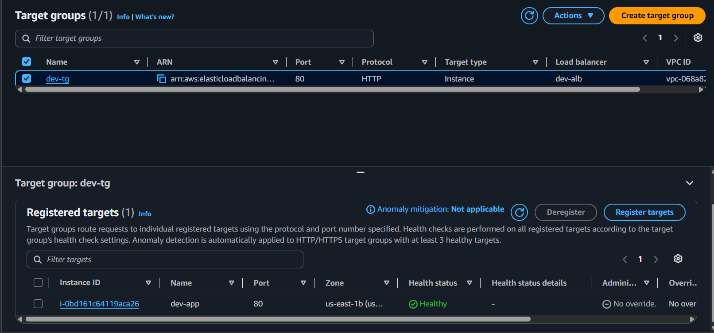
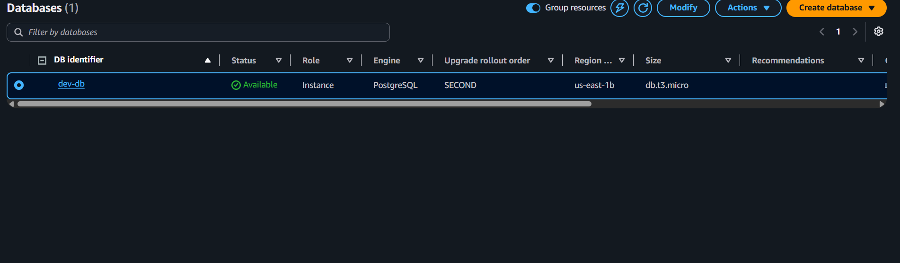

# terraform-aws-webapp

A production-style, 3-tier web application infrastructure on AWS, built entirely with modular Terraform. This project demonstrates infrastructure design patterns used in real engineering teams — not just "spin up a VM" — including remote state management, network segmentation, auto-scaling, managed secrets, and cost-conscious architecture decisions.

## Architecture

```
                              Internet
                                 │
                                 ▼
                    ┌────────────────────────┐
                    │   Application Load      │
                    │   Balancer (public)     │
                    └────────────┬────────────┘
                                 │
                    ┌────────────▼────────────┐
                    │      Target Group        │
                    │   (health checks: /)     │
                    └────────────┬────────────┘
                                 │
              ┌──────────────────┴──────────────────┐
              ▼                                      ▼
    ┌───────────────────┐               ┌───────────────────┐
    │  EC2 (private AZ-a) │               │  EC2 (private AZ-b) │
    │  Auto Scaling Group │◄─────────────►│  Auto Scaling Group │
    └──────────┬─────────┘               └─────────┬─────────┘
               │                                    │
               └──────────────────┬─────────────────┘
                                   ▼
                       ┌────────────────────┐
                       │   RDS PostgreSQL    │
                       │   (private subnet)  │
                       └────────────────────┘
```

**Traffic flow:** Client → ALB (public subnet) → Target Group → EC2 instance (private subnet, via Auto Scaling Group) → RDS PostgreSQL (private subnet). Nothing except the ALB is reachable from the internet.

## Tech stack

| Layer | Technology |
|---|---|
| IaC | Terraform ≥ 1.5, AWS Provider ~> 5.0 |
| Networking | VPC, public/private subnets across 2 AZs, NAT Gateway, Internet Gateway |
| Load balancing | Application Load Balancer (Layer 7) |
| Compute | EC2 Auto Scaling Group (t3.micro), target-tracking scaling on CPU |
| Database | RDS PostgreSQL (db.t3.micro), private subnet only |
| Secrets | AWS Secrets Manager (DB password generated via `random_password`, never hardcoded) |
| State | Remote state in S3 with versioning + encryption, locked via DynamoDB |

## Project structure

```
terraform-aws-webapp/
├── bootstrap/                  # One-time setup: S3 state bucket + DynamoDB lock table
│   └── main.tf
├── modules/
│   ├── vpc/                    # VPC, subnets, route tables, NAT/IGW
│   ├── alb/                    # Application Load Balancer, target group, listener
│   ├── asg/                    # Launch template, Auto Scaling Group, scaling policy
│   └── rds/                    # PostgreSQL instance, subnet group, Secrets Manager
├── environments/
│   └── dev/                    # Environment-specific config, calls all 4 modules
│       ├── main.tf
│       ├── variables.tf
│       ├── terraform.tfvars
│       ├── backend.tf          # Points state to S3 key: dev/terraform.tfstate
│       └── outputs.tf
└── README.md
```

Each module is environment-agnostic — none of them hardcode `dev` or `prod`. Adding a `prod` environment means creating `environments/prod/` with the same module calls, a separate state file, and its own `.tfvars` (larger instance sizes, `multi_az = true`, etc.) — no changes to the modules themselves.

## Design decisions and tradeoffs

| Decision | Why | Tradeoff acknowledged |
|---|---|---|
| Private subnets for app + DB | Nothing behind the ALB has a public IP or internet route — defense in depth | N/A, no real downside |
| Security-group chaining (ALB SG → app SG → DB SG) | Identity-based trust instead of IP-based; survives IP changes | N/A |
| Single NAT Gateway (not one per AZ) | Saves ~$32/month vs. one-per-AZ | Single point of failure for private-subnet egress; would go per-AZ in real prod |
| Directory-per-environment (not Terraform workspaces) | Explicit, hard to accidentally apply to the wrong environment; lets prod config diverge freely | More duplicated boilerplate across environments |
| DB password via `random_password` + Secrets Manager | Never hardcoded, never in version control | Still visible in Terraform state (see Known Limitations) |
| `skip_final_snapshot = true`, `recovery_window_in_days = 0` on RDS/secret | Faster iteration while actively building/destroying a dev environment | Would use snapshots + a real recovery window in production |
| Single-AZ RDS (`multi_az = false`) | Stays within free-tier / minimizes cost for a demo | No automatic failover; would enable Multi-AZ in production |

## Remote state

State is never stored locally. `bootstrap/` provisions an S3 bucket (versioned, encrypted) and a DynamoDB table (lock) once, and every environment's `backend.tf` points at a unique state key within that bucket:

```hcl
terraform {
  backend "s3" {
    bucket         = "yourname-terraform-state-webapp"
    key            = "dev/terraform.tfstate"
    region         = "us-east-1"
    dynamodb_table = "terraform-lock-webapp"
    encrypt        = true
  }
}
```

This gives a shared, lockable source of truth — no "it works on my machine" state drift, and no two people/pipelines applying concurrently and corrupting state.

## Getting started

**Prerequisites:** Terraform ≥ 1.5, AWS CLI configured with credentials, an AWS account.

```bash
# 1. One-time: provision the remote state backend
cd bootstrap
terraform init
terraform apply

# 2. Deploy the dev environment
cd ../environments/dev
terraform init
terraform plan     # review carefully before applying
terraform apply

# 3. Get the app URL
terraform output alb_dns_name
# Paste into a browser — you should see "Hello from dev - <hostname>"

# 4. Tear down when done (important for cost control)
terraform destroy
```

## Verification

**Live application:**




**VPC resource map** — VPC, 4 subnets across 2 AZs, route tables:



**Target group health** — proves the ALB → target group → EC2 chain is actually working, not just provisioned:



**RDS instance** — running, and confirmed private (`Publicly accessible: No`):



## Known limitations

Being upfront about what this project doesn't (yet) handle:

- **DB password is still visible in Terraform state**, even though it's never hardcoded or committed. `terraform state` output isn't fully secret-safe by default. A stricter setup would use Terraform's `ephemeral` values (1.10+) or provision secrets fully out-of-band.
- **No HTTPS.** The ALB currently only has an HTTP listener on port 80. Production would add an ACM certificate and a 443 listener with an HTTP→HTTPS redirect.
- **Single NAT Gateway** is a single point of failure for private-subnet outbound traffic. Acceptable for a demo; would be one-per-AZ in production.
- **IAM user with broad permissions** is used to apply Terraform locally. A real team setup would use a least-privilege deploy role, ideally assumed via OIDC federation from CI rather than long-lived access keys.
- **No automated testing.** No Terratest, `tfsec`, or `checkov` scanning yet — see Roadmap.
- **No CI/CD pipeline yet** — currently applied manually from a local machine.

## Roadmap

- [ ] GitHub Actions pipeline: `terraform fmt`/`validate`/`tflint` + `plan` posted as a PR comment, `apply` on merge to `main`
- [ ] ACM certificate + HTTPS listener on the ALB
- [ ] `environments/prod/` with Multi-AZ RDS and per-AZ NAT Gateways
- [ ] OIDC-based GitHub Actions → AWS auth (replace static access keys)
- [ ] `tfsec`/`checkov` security scanning in CI
- [ ] Terratest coverage for the VPC and ALB modules

## Cost notes

Built and tested using AWS Free Tier / promotional credits. Approximate always-on costs if left running:

- NAT Gateway: ~$32/month + data processing
- Application Load Balancer: ~$16/month
- RDS `db.t3.micro`: free tier eligible (750 hrs/month) for 12 months, then ~$12/month
- EC2 `t3.micro` x2: free tier eligible (750 hrs/month combined) for 12 months

**This environment is not left running.** `terraform destroy` is run after each testing session — see `terraform destroy` in Getting Started above.

## License

MIT
